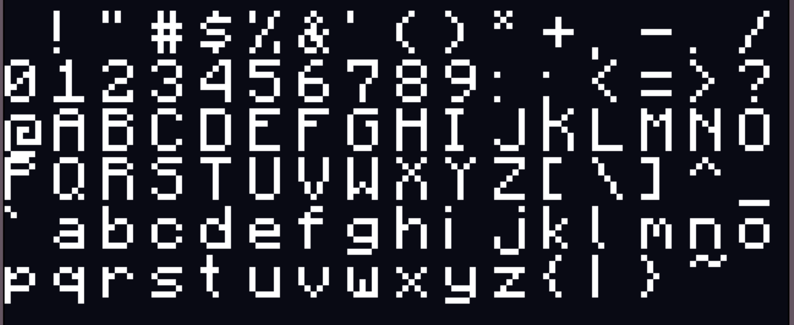

# pixL
String to pixel length converter for the default minecraft font

# How to use
* For versions 1.20.2 and above
* Drop the zip folder directly into your datapacks folder
* Set your string by using the following command
  
  ```mcfunction
  data modify storage hm:pixl root.in set value "YOUR STRING HERE"
  ```

* If your string is supposed to be bold, run the following command:
  
  ```mcfunction
  scoreboard players set .bold hm.pixl 1
  ```

* Run the following command:

  ```mcfunction
  function pixl:start
  ##Output
  scoreboard players get .out hm.pixl
  ```

* Allowed Characters:
  

  


